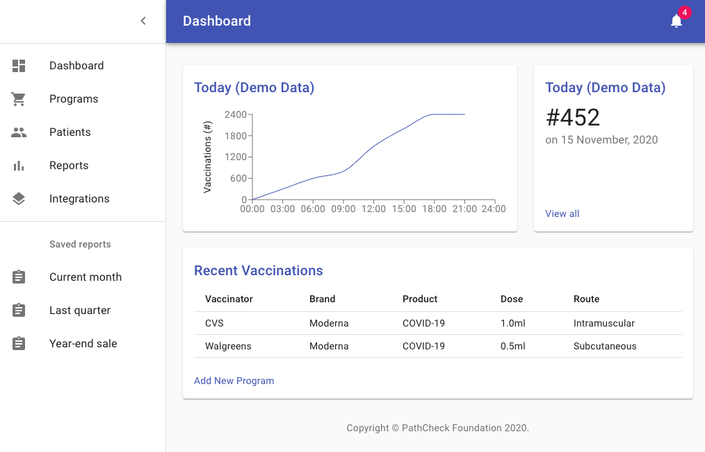

# Health Passport Health Provider Portal Rails Rest API

This is a Rails-based backend for a Health Provider portal to manage and sign Vaccination Certificates. 

The UI part is [here](https://github.com/vitorpamplona/healthpassport-provider-portal-ui). 
A Demo hot deployed from staging is [here](https://healthpassport.vitorpamplona.com/). 



## Behaviour

1. Health Provider Signs UP for the service. 
2. Health Provider creates a Vaccination Program. 
3. Health Provider generates a QR code, prints and places it visible for patients to scan. 

4. Patiens scan the QR Code after testing. 
5. QR Code takes patients to this portal, where. 
5.1. Users add their name to the certificate
5.2. Press button to generate and download. 
5. Portal generates que QR code text, signs and starts downloading the QR code with the Vaccine Certification. 

6. Users load on their signed certificate to the [Health Passport Reader app](https://github.com/vitorpamplona/healthpassport-reader-app). 

## QR Code formats used: 

There are two main QR formats we use: (i) a signed public URL that is used to generate an imunization certificate and (ii) the signed immunization certificate itself. It follows the format. 

### A Signed Vaccine Program Public URL for Users to Generate Certificates

The Signed Public URL is generated for a Vaccination Proram to be placed publically in the Vaccination site. 
It allows patients to scan the information of the vaccine, insert their names and generate a signed certificate from the 
Vaccinator's private key. 

```http://{UI_URL}/generateCertificate/{id_program}?date=YYYY-MM-DD&signature={RSA_SHA256}```

Example:

```
https://healthpassport.vitorpamplona.com/generateCertificate/9?date=2020-11-26&signature=
x9iSOLHgdlP5DUN4Aj2cbAqF1mDmkYcwB%2Bt327U6izI84QJXVDzN1ETfFfU8%
0ADFfvuAnnwysM0NnycHjqMJMvlscDNeqqLcSzCoswMAfN6pSAboqdXArpP0gj%
0AzUNP82cLI3OesK2TFNnwRiGkaakxGsEhaVX0x%2BriCr3Qk%2B5Py4c%3D%0A
```

### Immunization Certificate

The certificate is the signed record that prove a patient name has taken a vaccine. It follows the format: 

```
healthpass:typeOfHash\signature@pubKeyURL?<record as queryString>
```

Example:

```
healthpass:SHA256\XhwgTyPE+Q6EaeEY+I10PbMI3i7yP6y73/tyYcjjtLciTW
adqjVoQ9xBrQxzVBCsu53dmA6f/kH9QFLHiRpa+SGe3+fjMLQrT5r19rEYYewA0P
WFMNRUg3uYsxvaYTaK7ZuMKypR1BDE1jFUkYlbcf15/yM2CBf1Msx5+tc5qv0=
@vitorpamplona.com/vaccine-certificate-qrcode-generator/pub_key?
date=2020-11-27T15:19:55.682Z&vaccinee=Vitor%20Fernando%20Pamplona
&vaccinator=CVS%20Minute%20Clinics&manuf=Pfizer&name=COVID19&lot=1221
&route=Intramuscular&site=Right%20arm&dose=1.0
```

## Features / TO-DO List

- [x] Health Provider Sign Up
- [x] Health Provider Login 
- [x] Home Page
- [x] New Vaccination Programs
- [x] Listing Vaccination Programs on Home Page
- [x] Generate and Sign Vaccination Program QR Code to Print
- [x] Accept patient access to ask for their Name and sign the QR Code with Provider's Primary Key
- [x] Generate and Download Patient's signed Certificate.
- [x] Sign the Vaccination Program QR Code on the server
- [x] Sign the Certificate of Vaccination QR Code on the server
- [x] User's public key download
- [x] Percent-encoding and Base64 for signatures
- [x] Staging deployed [here](https://healthpassport.vitorpamplona.com/)
- [ ] Health Provider's Password recovery (Forgot My Password logic)
- [ ] Edit Vaccination Program
- [ ] Rails error messages on the browser are exposing routes and potentially confidential information. Have to remove this somehow. 
- [ ] Dockerize it
- [ ] Reduce amount of data on QRCodes

## Running

Make sure you have everything you need to run a Ruby 2.5 / Rails 6 service. 

Install modules:
`bundle install`

Start the API server
`rails server `

## Staging Server

This project is deployed to [https://healthpassport-api.vitorpamplona.com](https://healthpassport-api.vitorpamplona.com) at every commit. 

## Contributing

[Issues](https://github.com/Path-Check/healthpassport-provider-portal-api/issues) and [pull requests](https://github.com/Path-Check/healthpassport-provider-portal-api/pulls) are very welcome! :)
